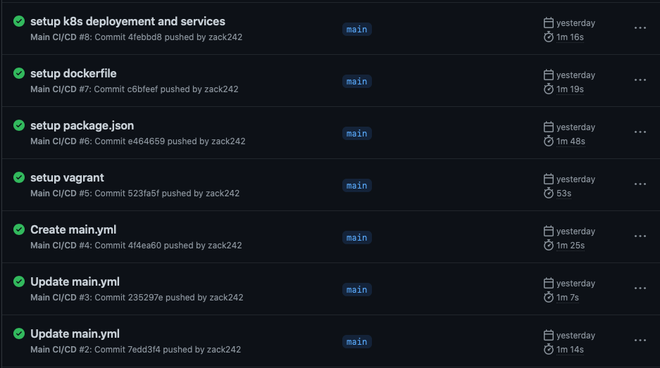
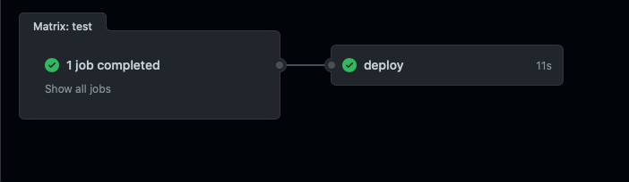
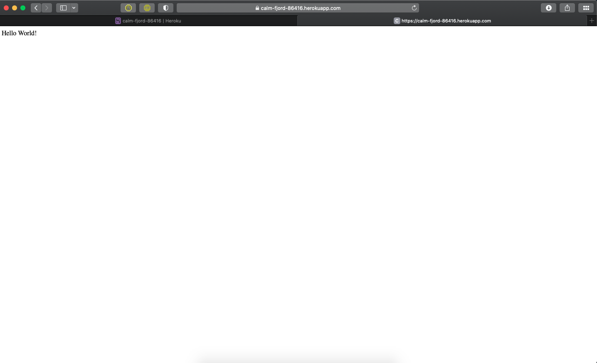
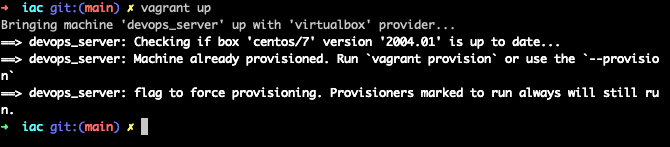
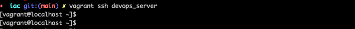

# Project of Devops

Repository of our project of DevOps

## Students

Zakaria Tozy <br>
email : Zakaria.tozy@edu.ece.fr <br>

Dan Nezri <br>
email : dan.nezri@edu.ece.fr <br>


## Projet

### 1. Create a web application

We used as support the lab 4 of DevOps, Where the front end will show us a Hello world page.

### 2. Apply CI/CD pipeline

We want to implement Continuous integration and Continuous Delivery so :<br>
-For the Continuous integration We implemented a main.yaml file which allows us to configure github action.Github action will perform tests at each push or pull request on the main branch <br>



- For the Continuous Delivery, We used Heroku : https://dashboard.heroku.com.
We configurated our workflows to deploy our application in heroku after the Continuous Testing.<br>



In heroku, we created an application and this is the dashboard


If we go on Heroku we got a link and we can see our application.


### 3. Configure and provision a virtual environment and run your application using the IaC approach

Vagrant is an open-source software product for building and maintaining portable virtual software development environments.We use vagrant with the centos7 distribution of linux,to configure the linux environment we use the following command.<br>

```
vagrant box add centos/7
```
chose the option 3 : virtual box.<br>

Now we can run our vagrant configuration file using : <br>
```
vagrant up
```


Now we can acces to our virtual machine using ssh : <br>
```
vagrant ssh devops_server
```


Ansible is an open-source software provisioning, configuration management, and application-deployment tool enabling infrastructure as code.<br>

In our Vagrantfile,we configurate provision with Ansible

```
# Use Vagrant Ansible provisioner
config.vm.provision "ansible_local" do |ansible|
  # The path to the playbooks entry point
  ansible.playbook = "playbooks/run.yml"
  # Only run the roles with these tags
  ansible.tags = "install"
end
```
We try to do the provision of <br>
#language runtime
#database
#your application (use sync folders)
#health check of your application

But sadly, we didn't success !

### 4. Build Docker image of your application

First we used DockerDestop we run on our cli in the correct folder :
```
docker build -t dockerfile
```
We get on our DockerDestop the following image :


We run on the correct port using this command.
```
docker run -p 3000:3000 -d dockerfile
```
And we get : <br>


Then we want to implement it on dockerhub https://hub.docker.com/<br>
my profile name is arthur92i and link it to my dockerdestop
I push the image on it :
```
docker tag dockerfile arthur92i/Dockerfile
docker push arthur92i/dockerfile
```
And get this on my page.


### 5. Make container orchestration using Docker Compose

We add a file docker-compose.yaml for the container orchestration and using the following command :
```
docker-compose up -d
```
on the localhost we find again the Hello World

And on the DockerDestop we have also now a devops running :


### 6. Make docker orchestration using Kubernetes

We implement a new folder call k8s where our deployment.yaml and our services.yaml. After using the following command for activating our minikube :
```
minikube start
kubectl apply -f deployment.yaml
kubectl apply -f services.yaml
kubectl get pods
```
We see the following pods running :


And with the command :
```
minikube ip
```
We get the following table that indicate the url and target port


And the following page open :

### 7. Make a service mesh using Istio

### 8. Implement Monitoring to your containerized application
